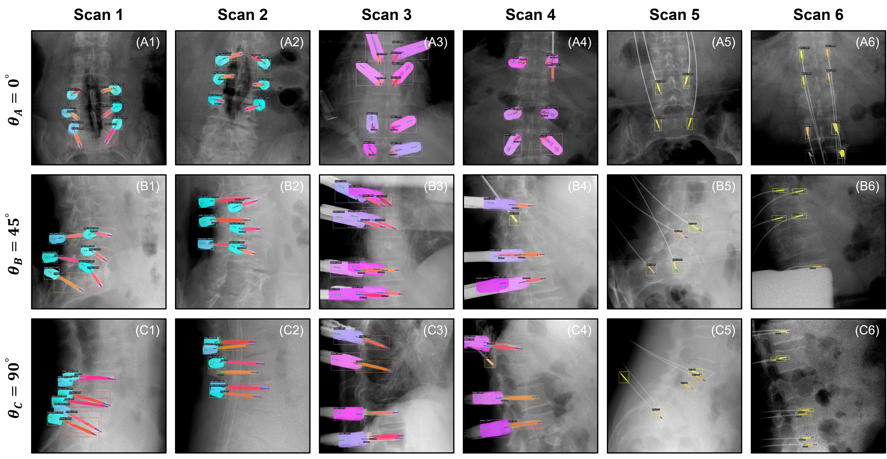
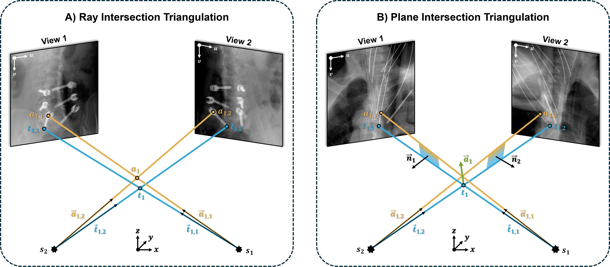

# Implant-Detection

We provide only simulated example cases as we are not allowed to share real clinical patient data / images ...


## Requirements

Setup a conda environment and install detectron2 (see external link)

[conda_environment.yaml](conda_environment.yaml)

Download the following PyTorch model checkpoints to your local download directory:

| Model Architecture | # Parameters | Download                           |
|:------------------:|:------------:|:----------------------------------:|
| Faster-R-CNN       | 58.8 M       | [Checkpoint](https://huggingface.co/joshua-scheuplein/Implant-Detector-Faster-R-CNN/resolve/main/Implant_Detector_Faster_R_CNN.pth) |
| Mask-R-CNN         | 61.4 M       | [Checkpoint](https://huggingface.co/joshua-scheuplein/Implant-Detector-Mask-R-CNN/resolve/main/Implant_Detector_Mask_R_CNN.pth) |

## Model Inference

<table border="1" style="border-collapse: collapse; width:100%;">
  <!-- Define column widths -->
  <colgroup>
    <col style="width:20%;">
    <col style="width:20%;">
    <col style="width:20%;">
    <col style="width:20%;">
    <col style="width:20%;">
  </colgroup>

  <!-- Header rows -->
  <tr>
    <th rowspan="2" style="text-align:center;">Metric</th>
    <th colspan="2" style="text-align:center;">Faster R-CNN</th>
    <th colspan="2" style="text-align:center;">Mask R-CNN</th>
  </tr>
  <tr>
    <th style="text-align:center;">BBs</th>
    <th style="text-align:center;">KPs</th>
    <th style="text-align:center;">BBs</th>
    <th style="text-align:center;">KPs</th>
  </tr>

  <!-- Data rows -->
  <tr>
    <td style="text-align:left;"><b>mAP@0.50:0.95</b></td>
    <td style="text-align:center;">60.9 &plusmn; 3.0</td>
    <td style="text-align:center;">53.8 &plusmn; 4.1</td>
    <td style="text-align:center;">64.7 &plusmn; 2.6</td>
    <td style="text-align:center;">58.0 &plusmn; 4.4</td>
  </tr>
  <tr>
    <td style="text-align:left;"><b>mAP@0.75</b></td>
    <td style="text-align:center;">72.6 &plusmn; 3.2</td>
    <td style="text-align:center;">56.7 &plusmn; 4.1</td>
    <td style="text-align:center;">78.4 &plusmn; 3.3</td>
    <td style="text-align:center;">62.0 &plusmn; 5.4</td>
  </tr>
  <tr>
    <td style="text-align:left;"><b>mAP@0.50</b></td>
    <td style="text-align:center;">86.4 &plusmn; 2.7</td>
    <td style="text-align:center;">77.5 &plusmn; 4.9</td>
    <td style="text-align:center;">87.0 &plusmn; 2.3</td>
    <td style="text-align:center;">79.5 &plusmn; 4.2</td>
  </tr>

  <!-- Bold separator row -->
  <tr>
    <td colspan="5" style="border-bottom:3px solid black;"></td>
  </tr>

  <tr>
    <td style="text-align:left;"><b>mAR@0.50:0.95</b></td>
    <td style="text-align:center;">65.4 &plusmn; 3.0</td>
    <td style="text-align:center;">61.9 &plusmn; 4.4</td>
    <td style="text-align:center;">70.4 &plusmn; 2.2</td>
    <td style="text-align:center;">67.9 &plusmn; 3.7</td>
  </tr>
  <tr>
    <td style="text-align:left;"><b>mAR@0.75</b></td>
    <td style="text-align:center;">76.5 &plusmn; 3.2</td>
    <td style="text-align:center;">65.6 &plusmn; 4.4</td>
    <td style="text-align:center;">82.6 &plusmn; 2.5</td>
    <td style="text-align:center;">71.8 &plusmn; 4.1</td>
  </tr>
  <tr>
    <td style="text-align:left;"><b>mAR@0.50</b></td>
    <td style="text-align:center;">88.0 &plusmn; 2.6</td>
    <td style="text-align:center;">80.6 &plusmn; 4.5</td>
    <td style="text-align:center;">88.8 &plusmn; 2.3</td>
    <td style="text-align:center;">83.6 &plusmn; 3.3</td>
  </tr>
</table>



To perform inference run the following script [model_inference.py](model_inference.py) and is 

```bash
python implant_detection.py --download_dir="C:/Users/Username/Downloads/" --model_type="Mask-R-CNN"  
```

We provide only simulated example cases as we are not allowed to share real clinical patient data / images ...

## Triangulation



<table border="1" style="border-collapse: collapse; width:100%;">
  <!-- Define column widths -->
  <colgroup>
    <col style="width:10%;">
    <col style="width:15%;">
    <col style="width:15%;">
    <col style="width:15%;">
    <col style="width:15%;">
    <col style="width:15%;">
    <col style="width:15%;">
  </colgroup>

  <!-- Header rows -->
  <tr>
    <th rowspan="2" style="text-align:center;">Category</th>
    <th colspan="3" style="text-align:center;">Faster R-CNN</th>
    <th colspan="3" style="text-align:center;">Mask R-CNN</th>
  </tr>
  <tr>
    <th style="text-align:center;">Precision</th>
    <th style="text-align:center;">Recall</th>
    <th style="text-align:center;">F1-Score</th>
    <th style="text-align:center;">Precision</th>
    <th style="text-align:center;">Recall</th>
    <th style="text-align:center;">F1-Score</th>
  </tr>

  <!-- Data rows -->
  <tr>
    <td style="text-align:left;"><b>Screws</b></td>
    <td style="text-align:center;">68.4 &plusmn; 2.6</td>
    <td style="text-align:center;">76.4 &plusmn; 11.9</td>
    <td style="text-align:center;">71.9 &plusmn; 6.9</td>
    <td style="text-align:center;">85.2 &plusmn; 2.3</td>
    <td style="text-align:center;">79.8 &plusmn; 10.9</td>
    <td style="text-align:center;">82.1 &plusmn; 7.1</td>
  </tr>
  <tr>
    <td style="text-align:left;"><b>Tulips</b></td>
    <td style="text-align:center;">84.2 &plusmn; 3.4</td>
    <td style="text-align:center;">94.8 &plusmn; 4.0</td>
    <td style="text-align:center;">89.2 &plusmn; 3.7</td>
    <td style="text-align:center;">92.6 &plusmn; 6.4</td>
    <td style="text-align:center;">92.0 &plusmn; 5.7</td>
    <td style="text-align:center;">92.2 &plusmn; 5.2</td>
  </tr>
  <tr>
    <td style="text-align:left;"><b>Towers</b></td>
    <td style="text-align:center;">85.9 &plusmn; 3.7</td>
    <td style="text-align:center;">85.7 &plusmn; 4.3</td>
    <td style="text-align:center;">85.8 &plusmn; 4.0</td>
    <td style="text-align:center;">92.4 &plusmn; 0.4</td>
    <td style="text-align:center;">89.3 &plusmn; 4.2</td>
    <td style="text-align:center;">90.8 &plusmn; 2.2</td>
  </tr>
  <tr>
    <td style="text-align:left;"><b>K-Wires</b></td>
    <td style="text-align:center;">70.1 &plusmn; 9.9</td>
    <td style="text-align:center;">65.6 &plusmn; 19.7</td>
    <td style="text-align:center;">65.5 &plusmn; 10.6</td>
    <td style="text-align:center;">77.5 &plusmn; 14.3</td>
    <td style="text-align:center;">63.0 &plusmn; 9.0</td>
    <td style="text-align:center;">68.8 &plusmn; 8.5</td>
  </tr>

  <!-- Bold separator row -->
  <tr>
    <td colspan="7" style="border-bottom:3px solid black;"></td>
  </tr>

  <tr>
    <td style="text-align:left;"><b>Micro Average</b></td>
    <td style="text-align:center;">74.9 &plusmn; 2.6</td>
    <td style="text-align:center;">78.1 &plusmn; 10.2</td>
    <td style="text-align:center;">76.2 &plusmn; 5.7</td>
    <td style="text-align:center;">85.9 &plusmn; 4.5</td>
    <td style="text-align:center;">79.6 &plusmn; 7.7</td>
    <td style="text-align:center;">82.6 &plusmn; 6.0</td>
  </tr>

  <!-- Bold separator row -->
  <tr>
    <td colspan="7" style="border-bottom:3px solid black;"></td>
  </tr>

  <tr>
    <td style="text-align:left;"><b>Macro Average</b></td>
    <td style="text-align:center;">77.2 &plusmn; 3.5</td>
    <td style="text-align:center;">80.6 &plusmn; 8.4</td>
    <td style="text-align:center;">78.1 &plusmn; 5.3</td>
    <td style="text-align:center;">86.9 &plusmn; 5.3</td>
    <td style="text-align:center;">81.0 &plusmn; 6.3</td>
    <td style="text-align:center;">83.5 &plusmn; 5.6</td>
  </tr>
</table>

To perform triangulation run the following script [model_inference.py](model_inference.py) and is 

```bash
python implant_triangulation.py --model_type="Mask-R-CNN" --detection_type="predictions" --enable_refinement="False"
```

Example Output:


## License
This repository is released under the Apache License 2.0. See [LICENSE](LICENSE) for additional details.
