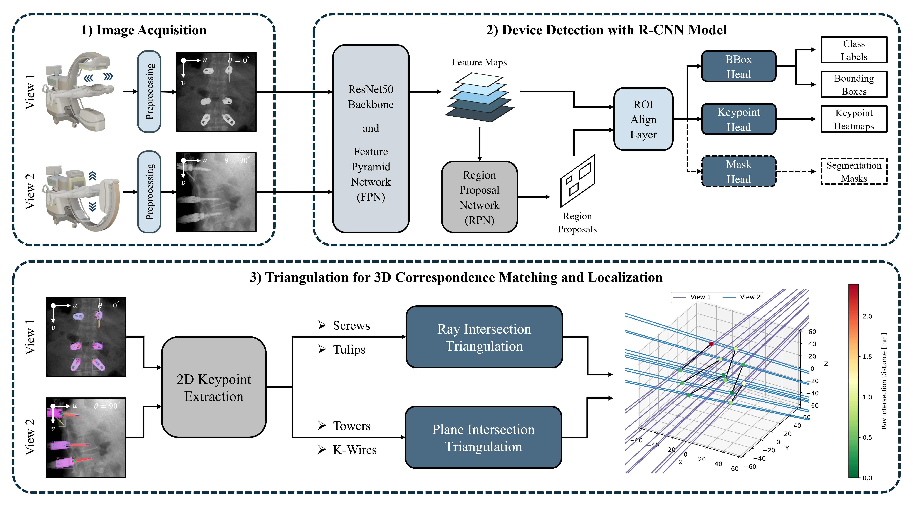
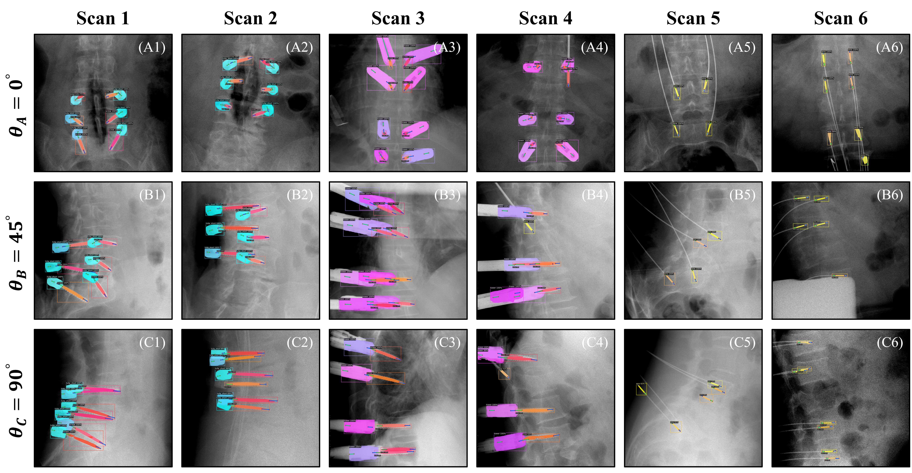
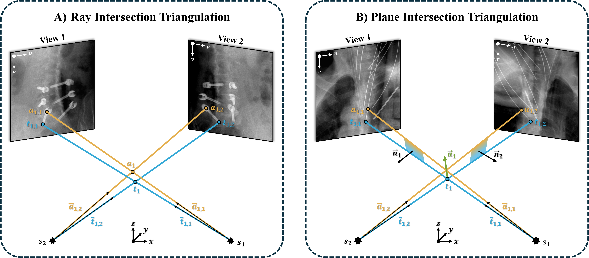
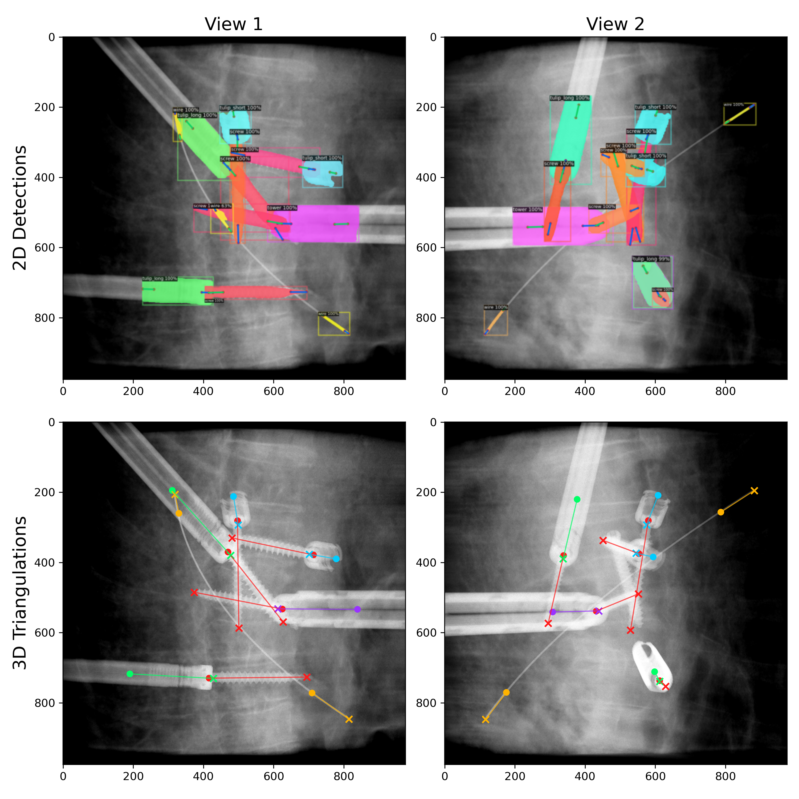

# Surgical-Device-Detection

This repository implements methods for **geometry-consistent 3D pose estimation of surgical devices from 2D object detections in orthopedic and trauma spine procedures**. It includes pretrained checkpoints for **Faster R-CNN** and **Mask R-CNN** models used for 2D device detection in projection images. In addition, the repository provides scripts for **model inference** as well as for estimating the 3D position and orientation of devices by **triangulating the detected 2D keypoints** from two fluoroscopic views. All reported quantitative results are based exclusively on **evaluations using real clinical data**. Due to data privacy restrictions, these clinical images cannot be shared publicly. Therefore, this repository includes [simulated example cases](assets/input_images) (provided as TIFF files) for demonstrating the full inference and triangulation pipeline.

<p align="center">
  
</p>

## Requirements

To run model inference and perform triangulation, a Python environment must be set up first. We recommend creating a new **conda environment** using **Python 3.9**. Within this environment, the **Detectron2 package** must be installed by following this official installation guide: [Install Detectron2](https://detectron2.readthedocs.io/en/v0.6/tutorials/install.html)

All remaining package dependencies are specified in the provided YAML file: [conda_environment.yaml](conda_environment.yaml)

To use the pretrained device detection models for inference, please download the **PyTorch model checkpoints** to a local directory on your system (e.g., C:/Users/Username/Downloads):

| Model Architecture | # Parameters | Download                           |
|:------------------:|:------------:|:----------------------------------:|
| Faster R-CNN       | 58.8 M       | [Checkpoint](https://huggingface.co/joshua-scheuplein/Implant-Detector-Faster-R-CNN/resolve/main/Implant_Detector_Faster_R_CNN.pth) |
| Mask R-CNN         | 61.4 M       | [Checkpoint](https://huggingface.co/joshua-scheuplein/Implant-Detector-Mask-R-CNN/resolve/main/Implant_Detector_Mask_R_CNN.pth) |

## Model Inference

For performing **model inference**, execute the script [device_detection.py](device_detection.py) using the following command:

```bash
python device_detection.py --download_dir="C:/Users/Username/Downloads/" --model_type="Mask-R-CNN"  
```

We report both quantitative and qualitative results obtained on real clinical test scans as follows:

<table border="1" style="border-collapse: collapse; width:100%;">
  <!-- Define column widths -->
  <colgroup>
    <col style="width:20%;">
    <col style="width:20%;">
    <col style="width:20%;">
    <col style="width:20%;">
    <col style="width:20%;">
  </colgroup>

  <!-- Header rows -->
  <tr>
    <th rowspan="2" style="text-align:center;">Metric</th>
    <th colspan="2" style="text-align:center;">Faster R-CNN</th>
    <th colspan="2" style="text-align:center;">Mask R-CNN</th>
  </tr>
  <tr>
    <th style="text-align:center;">BBs</th>
    <th style="text-align:center;">KPs</th>
    <th style="text-align:center;">BBs</th>
    <th style="text-align:center;">KPs</th>
  </tr>

  <!-- Data rows -->
  <tr>
    <td style="text-align:left;"><b>mAP@0.50:0.95</b></td>
    <td style="text-align:center;">60.9 &plusmn; 3.0</td>
    <td style="text-align:center;">53.8 &plusmn; 4.1</td>
    <td style="text-align:center;"><b>64.7</b> &plusmn; 2.6</td>
    <td style="text-align:center;"><b>58.0</b> &plusmn; 4.4</td>
  </tr>
  <tr>
    <td style="text-align:left;"><b>mAP@0.75</b></td>
    <td style="text-align:center;">72.6 &plusmn; 3.2</td>
    <td style="text-align:center;">56.7 &plusmn; 4.1</td>
    <td style="text-align:center;"><b>78.4</b> &plusmn; 3.3</td>
    <td style="text-align:center;"><b>62.0</b> &plusmn; 5.4</td>
  </tr>
  <tr>
    <td style="text-align:left;"><b>mAP@0.50</b></td>
    <td style="text-align:center;">86.4 &plusmn; 2.7</td>
    <td style="text-align:center;">77.5 &plusmn; 4.9</td>
    <td style="text-align:center;"><b>87.0</b> &plusmn; 2.3</td>
    <td style="text-align:center;"><b>79.5</b> &plusmn; 4.2</td>
  </tr>

  <!-- Bold separator row -->
  <tr>
    <td colspan="5" style="border-bottom:3px solid black;"></td>
  </tr>

  <tr>
    <td style="text-align:left;"><b>mAR@0.50:0.95</b></td>
    <td style="text-align:center;">65.4 &plusmn; 3.0</td>
    <td style="text-align:center;">61.9 &plusmn; 4.4</td>
    <td style="text-align:center;"><b>70.4</b> &plusmn; 2.2</td>
    <td style="text-align:center;"><b>67.9</b> &plusmn; 3.7</td>
  </tr>
  <tr>
    <td style="text-align:left;"><b>mAR@0.75</b></td>
    <td style="text-align:center;">76.5 &plusmn; 3.2</td>
    <td style="text-align:center;">65.6 &plusmn; 4.4</td>
    <td style="text-align:center;"><b>82.6</b> &plusmn; 2.5</td>
    <td style="text-align:center;"><b>71.8</b> &plusmn; 4.1</td>
  </tr>
  <tr>
    <td style="text-align:left;"><b>mAR@0.50</b></td>
    <td style="text-align:center;">88.0 &plusmn; 2.6</td>
    <td style="text-align:center;">80.6 &plusmn; 4.5</td>
    <td style="text-align:center;"><b>88.8</b> &plusmn; 2.3</td>
    <td style="text-align:center;"><b>83.6</b> &plusmn; 3.3</td>
  </tr>
</table>

<p align="center">
  
</p>

## Triangulation

<p align="center">
  
</p>

To perform **triangulation**, run the script [device_triangulation.py](device_triangulation.py) using the following command:

```bash
python device_triangulation.py --model_type="Mask-R-CNN" --detection_type="predictions" --enable_refinement="False"
```

Quantitative results obtained on clinical test scans are summarized in the table below:

<table border="1" style="border-collapse: collapse; width:100%;">
  <!-- Define column widths -->
  <colgroup>
    <col style="width:10%;">
    <col style="width:15%;">
    <col style="width:15%;">
    <col style="width:15%;">
    <col style="width:15%;">
    <col style="width:15%;">
    <col style="width:15%;">
  </colgroup>

  <!-- Header rows -->
  <tr>
    <th rowspan="2" style="text-align:center;">Category</th>
    <th colspan="3" style="text-align:center;">Faster R-CNN</th>
    <th colspan="3" style="text-align:center;">Mask R-CNN</th>
  </tr>
  <tr>
    <th style="text-align:center;">Precision</th>
    <th style="text-align:center;">Recall</th>
    <th style="text-align:center;">F1-Score</th>
    <th style="text-align:center;">Precision</th>
    <th style="text-align:center;">Recall</th>
    <th style="text-align:center;">F1-Score</th>
  </tr>

  <!-- Data rows -->
  <tr>
    <td style="text-align:left;"><b>Screws</b></td>
    <td style="text-align:center;">68.4 &plusmn; 2.6</td>
    <td style="text-align:center;">76.4 &plusmn; 11.9</td>
    <td style="text-align:center;">71.9 &plusmn; 6.9</td>
    <td style="text-align:center;"><b>85.2</b> &plusmn; 2.3</td>
    <td style="text-align:center;"><b>79.8</b> &plusmn; 10.9</td>
    <td style="text-align:center;"><b>82.1</b> &plusmn; 7.1</td>
  </tr>
  <tr>
    <td style="text-align:left;"><b>Tulips</b></td>
    <td style="text-align:center;">84.2 &plusmn; 3.4</td>
    <td style="text-align:center;">94.8 &plusmn; 4.0</td>
    <td style="text-align:center;">89.2 &plusmn; 3.7</td>
    <td style="text-align:center;"><b>92.6</b> &plusmn; 6.4</td>
    <td style="text-align:center;"><b>92.0</b> &plusmn; 5.7</td>
    <td style="text-align:center;"><b>92.2</b> &plusmn; 5.2</td>
  </tr>
  <tr>
    <td style="text-align:left;"><b>Towers</b></td>
    <td style="text-align:center;">85.9 &plusmn; 3.7</td>
    <td style="text-align:center;">85.7 &plusmn; 4.3</td>
    <td style="text-align:center;">85.8 &plusmn; 4.0</td>
    <td style="text-align:center;"><b>92.4</b> &plusmn; 0.4</td>
    <td style="text-align:center;"><b>89.3</b> &plusmn; 4.2</td>
    <td style="text-align:center;"><b>90.8</b> &plusmn; 2.2</td>
  </tr>
  <tr>
    <td style="text-align:left;"><b>K-Wires</b></td>
    <td style="text-align:center;">70.1 &plusmn; 9.9</td>
    <td style="text-align:center;">65.6 &plusmn; 19.7</td>
    <td style="text-align:center;">65.5 &plusmn; 10.6</td>
    <td style="text-align:center;"><b>77.5</b> &plusmn; 14.3</td>
    <td style="text-align:center;"><b>63.0</b> &plusmn; 9.0</td>
    <td style="text-align:center;"><b>68.8</b> &plusmn; 8.5</td>
  </tr>

  <!-- Bold separator row -->
  <tr>
    <td colspan="7" style="border-bottom:3px solid black;"></td>
  </tr>

  <tr>
    <td style="text-align:left;"><b>Micro Average</b></td>
    <td style="text-align:center;">74.9 &plusmn; 2.6</td>
    <td style="text-align:center;">78.1 &plusmn; 10.2</td>
    <td style="text-align:center;">76.2 &plusmn; 5.7</td>
    <td style="text-align:center;"><b>85.9</b> &plusmn; 4.5</td>
    <td style="text-align:center;"><b>79.6</b> &plusmn; 7.7</td>
    <td style="text-align:center;"><b>82.6</b> &plusmn; 6.0</td>
  </tr>

  <!-- Bold separator row -->
  <tr>
    <td colspan="7" style="border-bottom:3px solid black;"></td>
  </tr>

  <tr>
    <td style="text-align:left;"><b>Macro Average</b></td>
    <td style="text-align:center;">77.2 &plusmn; 3.5</td>
    <td style="text-align:center;">80.6 &plusmn; 8.4</td>
    <td style="text-align:center;">78.1 &plusmn; 5.3</td>
    <td style="text-align:center;"><b>86.9</b> &plusmn; 5.3</td>
    <td style="text-align:center;"><b>81.0</b> &plusmn; 6.3</td>
    <td style="text-align:center;"><b>83.5</b> &plusmn; 5.6</td>
  </tr>
</table>

To **visualize the output of the triangulation methods**, we generate [preview images](assets/triangulation_results/) that summarize the triangulated device keypoints. The first row shows the initial 2D device detections for both projection views. The second row displays the corresponding 2D device locations obtained by **forward-projecting the triangulated 3D device positions** back onto the detector plane. A close alignment between the forward-projected 3D keypoints and the corresponding image features in the projection images indicates accurate and geometrically consistent triangulation.

<p align="center">
  
</p>

## License
This repository is released under the Apache License 2.0. See [LICENSE](LICENSE) for additional details.
