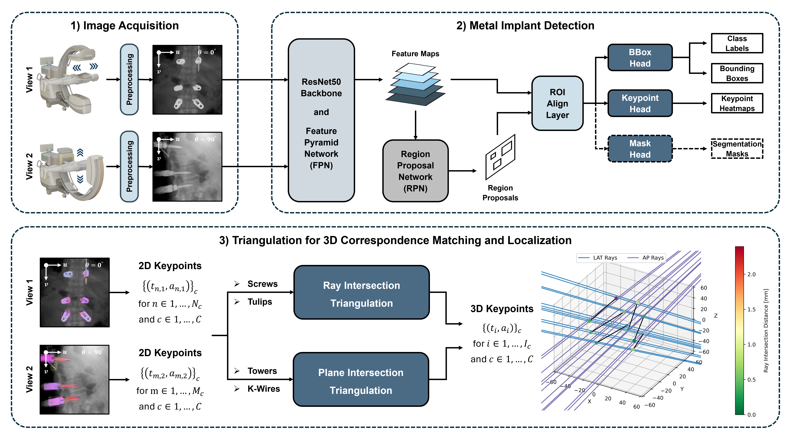

# Implant-Detection

We provide only simulated example cases as we are not allowed to share real clinical patient data / images ...

Reference to conda yaml file and detectron2 installation instructions

## Method


## Checkpoints

| Model Architecture | # Parameters | Download                           |
|:------------------:|:------------:|:----------------------------------:|
| Faster-R-CNN       | 58.8 M       | [Checkpoint](https://huggingface.co/joshua-scheuplein/Implant-Detector-Faster-R-CNN/resolve/main/Implant_Detector_Faster_R_CNN.pth) |
| Mask-R-CNN         | 61.4 M       | [Checkpoint](https://huggingface.co/joshua-scheuplein/Implant-Detector-Mask-R-CNN/resolve/main/Implant_Detector_Mask_R_CNN.pth) |

## Test Table

<table border="1">

  <!-- Define column widths and alignment -->
  <colgroup>
    <col style="width:20%; text-align:left;">
    <col style="width:80%; text-align:center;">
    <col style="width:20%; text-align:center;">
    <col style="width:20%; text-align:center;">
    <col style="width:20%; text-align:center;">
  </colgroup>

  <!-- Header rows -->
  <tr>
    <th rowspan="2">Metric</th>
    <th colspan="2">Faster R-CNN</th>
    <th colspan="2">Mask R-CNN</th>
  </tr>
  <tr>
    <th>Bounding Boxes</th>
    <th>Keypoints</th>
    <th>Bounding Boxes</th>
    <th>Keypoints</th>
  </tr>

  <!-- Data rows -->
  <tr>
    <th> mAP@0.50:0.95      </th>
    <td> 60.9 &plusmn; 3.0  </td>
    <td> 53.8 &plusmn; 4.1  </td>
    <td> 64.7 &plusmn; 2.6  </td>
    <td> 58.0 &plusmn; 4.4  </td>
  </tr>
  <tr>
    <th> mAP@0.75           </th>
    <td> 72.6 &plusmn; 3.2  </td>
    <td> 56.7 &plusmn; 4.1  </td>
    <td> 78.4 &plusmn; 3.3  </td>
    <td> 62.0 &plusmn; 5.4  </td>
  </tr>
  <tr>
    <th> mAP@0.50           </th>
    <td> 86.4 &plusmn; 2.7  </td>
    <td> 77.5 &plusmn; 4.9  </td>
    <td> 87.0 &plusmn; 2.3  </td>
    <td> 79.5 &plusmn; 4.2  </td>
  </tr>
  <tr>
    <th> mAR@0.50:0.95      </th>
    <td> 65.4 &plusmn; 3.0  </td>
    <td> 61.9 &plusmn; 4.4  </td>
    <td> 70.4 &plusmn; 2.2  </td>
    <td> 67.9 &plusmn; 3.7  </td>
  </tr>
  <tr>
    <th> mAR@0.75           </th>
    <td> 76.5 &plusmn; 3.2  </td>
    <td> 65.6 &plusmn; 4.4  </td>
    <td> 82.6 &plusmn; 2.5  </td>
    <td> 71.8 &plusmn; 4.1  </td>
  </tr>
  <tr>
    <th> mAR@0.50           </th>
    <td> 88.0 &plusmn; 2.6  </td>
    <td> 80.6 &plusmn; 4.5  </td>
    <td> 88.8 &plusmn; 2.3  </td>
    <td> 83.6 &plusmn; 3.3  </td>
  </tr>
</table>

## Inference
To perform inference run the following script [model_inference.py](model_inference.py) and is 

```bash
torchrun --nproc_per_node=4 main_dax_training.py --arch='resnet50' --flag=True'
```

## License
This repository is released under the Apache License 2.0. See [LICENSE](LICENSE) for additional details.
